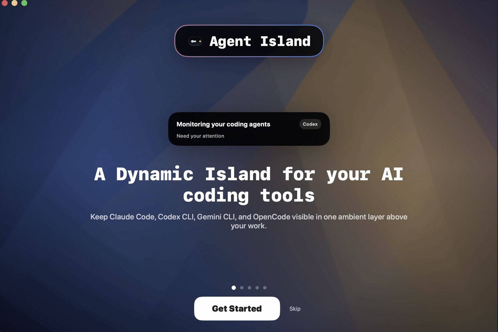

# Agent Island

**Agent Island** is a macOS Dynamic Island companion for people who run multiple AI coding agents every day.

It keeps agent attention on one ambient layer above your work so you can monitor progress, approve permissions, answer questions, review plans, and jump back to the right context without tab hunting.



## Why this exists

Most agent companions stop at passive monitoring. Agent Island is built for developers who are actually running Claude Code, Codex CLI, Gemini CLI, and OpenCode side-by-side and need a faster way to:

- notice when an agent needs attention
- approve or deny risky actions without breaking flow
- answer questions from the notch instead of context-switching into a terminal
- review plans and Markdown proposals in a compact, readable surface
- jump back to the exact terminal, pane, IDE surface, log, or working directory that matters

If you live in multiple agent sessions all day, Agent Island turns attention routing into a real productivity tool instead of another status widget.

## Who it is for

Agent Island is designed for **AI coding power users**:

- individual developers running multiple coding agents in parallel
- engineers who use agents for implementation, debugging, approvals, and plan review
- operators who want less context switching between terminals, CLIs, and IDE windows

## Core product value

### Monitor

See active agent sessions from Claude Code, Codex CLI, Gemini CLI, and OpenCode in one place.

### Approve

Handle permission prompts directly from the island instead of bouncing between windows.

### Ask

Answer agent questions from the notch and keep moving.

### Jump

Jump back to iTerm2, Terminal.app, Warp, tmux, or IDE terminal surfaces when a session needs you.

### Plan Review

Render Markdown and proposal-style content in a cleaner review surface, then respond inline.

## Market comparison

| Product | Sources | Approve | Ask | Plan Review | Jump | Sound Packs | Setup |
| --- | --- | --- | --- | --- | --- | --- | --- |
| **Agent Island** | Claude Code, Codex CLI, Gemini CLI, OpenCode | Yes | Yes | Yes | iTerm2, Terminal.app, Warp, tmux, VS Code/Cursor terminal bridge | Bundled default + importable packs | Auto-configured hooks |
| Claude Island | Claude Code | Yes | Limited / no structured question surface | No | Basic | No | Zero-config |
| Notchi | Claude Code | No | No | No | No | No | Zero-config |
| AgentNotch | Claude Code, Codex | No | No | No | Limited | No | Manual setup |

## Download and install

GitHub is the public home for Agent Island.

- Repository: [github.com/bozliu/agent-island](https://github.com/bozliu/agent-island)
- Releases: [github.com/bozliu/agent-island/releases](https://github.com/bozliu/agent-island/releases)

### Run from source

Requirements:

- macOS 15+
- Xcode at `/Applications/Xcode.app`

```bash
DEVELOPER_DIR=/Applications/Xcode.app/Contents/Developer swift run AgentIslandApp
```

### Build a local app bundle

```bash
scripts/build-app.sh
scripts/package-dmg.sh
```

The packaging flow writes artifacts to `dist/`.

## Open source and attribution

Agent Island is developed with inspiration from [claude-island](https://github.com/farouqaldori/claude-island).

The repo keeps the product public-facing, but avoids shipping private credentials, private feeds, or non-redistributable assets.

## Developer docs

- [CONTRIBUTING.md](CONTRIBUTING.md)
- [docs/architecture.md](docs/architecture.md)
- [docs/integrations.md](docs/integrations.md)
- [docs/release.md](docs/release.md)

## License

Apache-2.0. See [LICENSE](LICENSE).
